* content
{:toc}

# Docker Desktop for Windows Experience

[TOC]

## 安装 Docker CE 之前

### 试验目标

* 安装 Docker CE 并配置镜像加速，并能正常运行
* 启动 Docker 中的 Kubernetes，并能正常运行
* 配置 Kubernetes Dashboard，并能正常运行
* 了解熟悉过程、记录过程

### 系统要求

[Docker Desktop for Windows](https://docs.docker.com/docker-for-windows/install/) 支持 64 位版本的 Windows 10 Pro，且必须[开启 Hyper-V](https://segmentfault.com/a/1190000012288976)。

### 下载 Docker CE

点击以下链接下载 [Stable](https://download.docker.com/win/stable/Docker for Windows Installer.exe) 或 [Edge](https://download.docker.com/win/edge/Docker Desktop Installer.exe) 版本的 [Docker Desktop for Windows](https://hub.docker.com/editions/community/docker-ce-desktop-windows)。

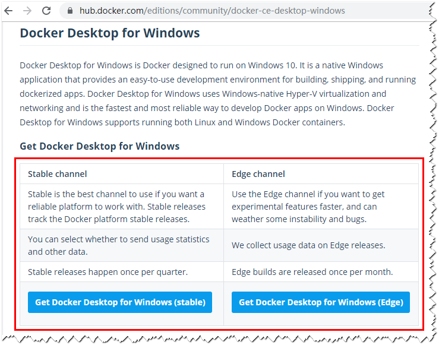

***本文以下载 Stable 版本为例。***

## 安装 Docker CE

* 下载好之后双击 `Docker for Windows Installer.exe` 开始安装。

* 安装好后，查看 `About Docker Desktop`

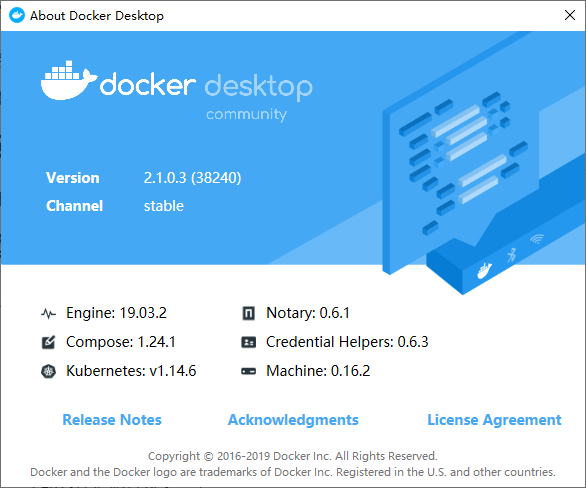

## 配置镜像加速

如果在使用过程中发现拉取 Docker 镜像十分缓慢，可以配置 [Docker 国内镜像加速](https://segmentfault.com/a/1190000019115546)。

* Azure 中国镜像 `https://dockerhub.azk8s.cn`

* 七牛云镜像 `https://reg-mirror.qiniu.com`

* 中科大镜像 `https://docker.mirrors.ustc.edu.cn`

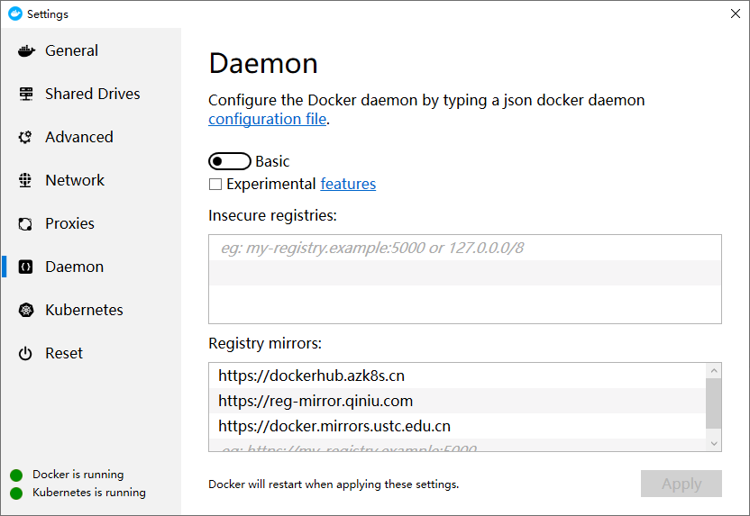

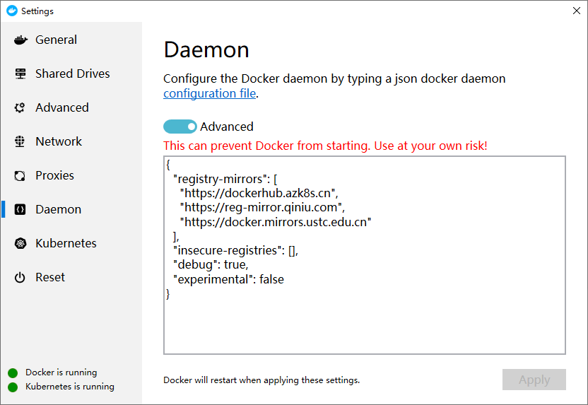

```json
{
  "registry-mirrors": [
    "https://dockerhub.azk8s.cn",
    "https://reg-mirror.qiniu.com",
    "https://docker.mirrors.ustc.edu.cn"
  ],
  "insecure-registries": [],
  "debug": true,
  "experimental": false
}
```

## 启用 Docker 中的 Kubernetes

### 安装 kubectl 命令

* 通过 Docker 的 `About Docker Desktop` 查看 kubernetes 的版本

  通过查看版本为 `kubernetes:v1.14.6` 。

* 下载 `kubernetes:v1.14.6` [kubernetes-client-windows-amd64.tar.gz](https://dl.k8s.io/v1.14.6/kubernetes-client-windows-amd64.tar.gz) （这需要科学上网）

  其他的版本下可通过 https://github.com/kubernetes/kubernetes 中相应版本的 `CHANGELOG-1.XX.md` 文件获取。

* 解压 kubernetes-client-windows-amd64.tar.gz 

  这里解压后目录为 `D:\Local\kubernetes\client\bin` 


* 将 `kubectl` 加入到 `系统环境变量PATH` 中

  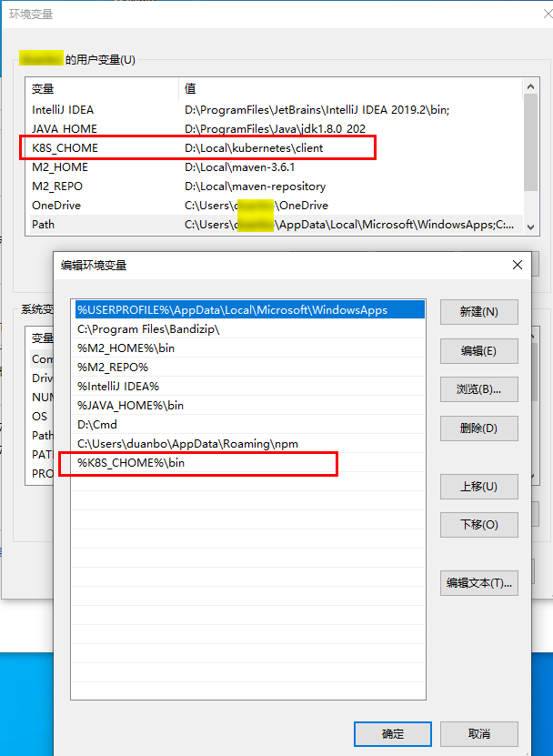

* 执行 `kubectl` 命令检查是否OK

  ```bash
  kubectl version
  ```

  

### 安装 kubernetes 镜像

* 可先参考 https://github.com/AliyunContainerService/k8s-for-docker-desktop 文档

* 通过 [AliyunContainerService/k8s-for-docker-desktop](https://github.com/AliyunContainerService/k8s-for-docker-desktop) 项目手工加载镜像，通过以下命令克隆项目

  (提示：会在执行命令的当前目录下创建 k8s-for-docker-desktop 目录)

  ```bash
  git clone https://github.com/AliyunContainerService/k8s-for-docker-desktop
  ```

* 切换到 k8s-for-docker-desktop 目录，执行 `.\load_images.ps1` 命令（使用 PowerShell）

  等镜像文件 pull 完后，就可以激活 Docker 中的 Kubernetes 了。

  ```bash
  .\load_images.ps1
  ```

  *这里 pull 的 Kubernetes 镜像为 1.14.6*

  **注意，PowerShell 执行命令时可能出现以下错误：**

  ```bash
  .\load_images.ps1 : 无法加载文件 D:\IdeaProjects\k8s-for-docker-desktop\load_images.ps1，因为在此系统上禁止运行脚本。
  ```

  执行以下[命令](https://blog.csdn.net/caijunfen/article/details/78521514)解决错误：

  ```bash
  set-executionpolicy remotesigned
  ```

* Docker 中激活 Kubernetes

  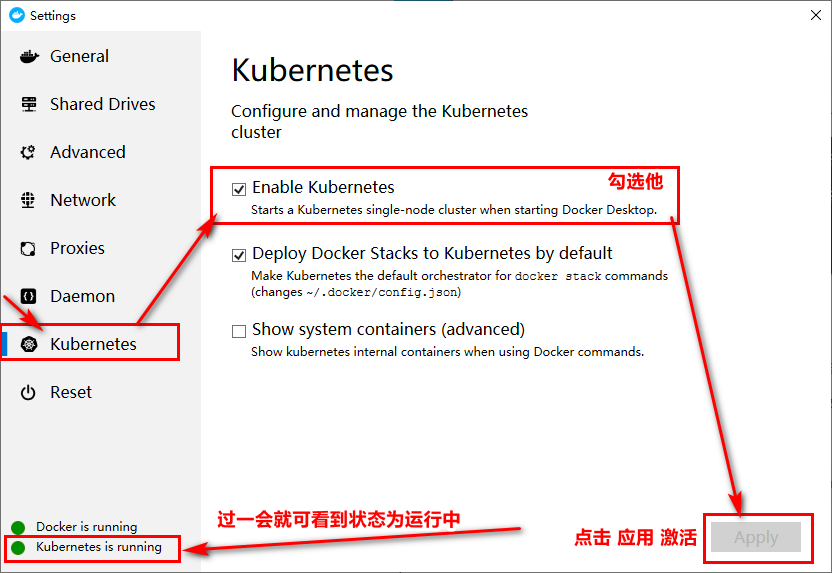

## 配置 Kubernetes Dashboard

### 可先参考的文档

* https://github.com/AliyunContainerService/k8s-for-docker-desktop 

* https://github.com/kubernetes/dashboard

### 切换 Kubernetes 运行上下文

切换 Kubernetes 运行上下文至 `docker--desktop`

```bash
kubectl config use-context docker-desktop
```

### 验证 Kubernetes 集群状态

```bash
kubectl cluster-info
kubectl get nodes
```

### 部署 Kubernetes dashboard

```bash
kubectl apply -f https://raw.githubusercontent.com/kubernetes/dashboard/v1.10.1/src/deploy/recommended/kubernetes-dashboard.yaml
```

### 开启 API Server 访问代理

```bash
kubectl proxy
```


### 访问 Kubernetes dashboard

* http://localhost:8001/api/v1/namespaces/kube-system/services/https:kubernetes-dashboard:/proxy/#!/overview?namespace=default

* http://localhost:8001/api/v1/namespaces/kube-system/services/https:kubernetes-dashboard:/proxy/

### 配置 kubeconfig (可跳过)

* 给配置 `C:\Users\XXX\.kube\config` 文件 `docker-desktop` 设置  `token`

  ```bash
  $TOKEN=((kubectl -n kube-system describe secret default | Select-String "token:") -split " +")[1]
  kubectl config set-credentials docker-desktop --token="${TOKEN}"
  ```

  **注意**，登陆是出现 `Not enough data to create auth info structure` 时，重新执行本命令即可！

  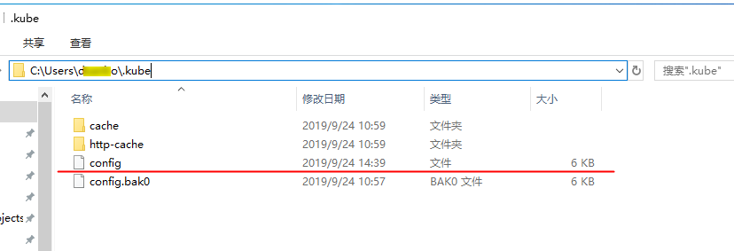

* 登录 dashboard 的时候选择 `C:\Users\XXX\.kube\config` 文件

  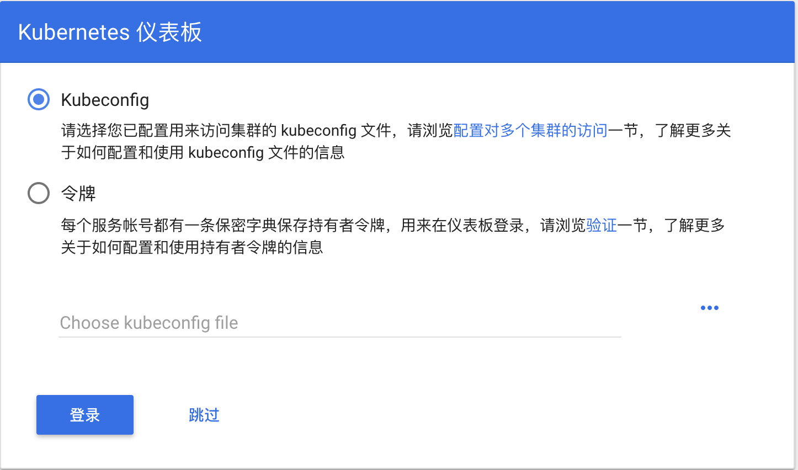

* 点击 `登录` 成功

  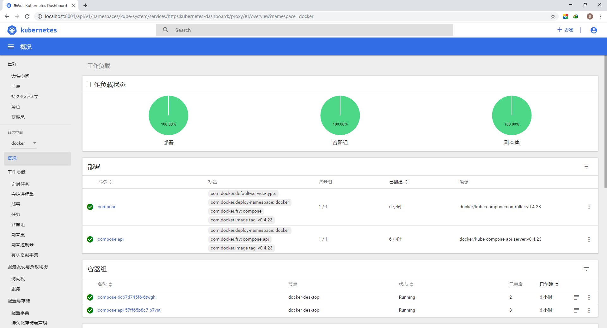

## 安装并运行容器（Redis）

* 本案例采用 Redis 演示

### 查找镜像

```bash
docker search redis[:5.5]
```


### 拉取镜像

```bash
docker pull redis[:5.5]
```

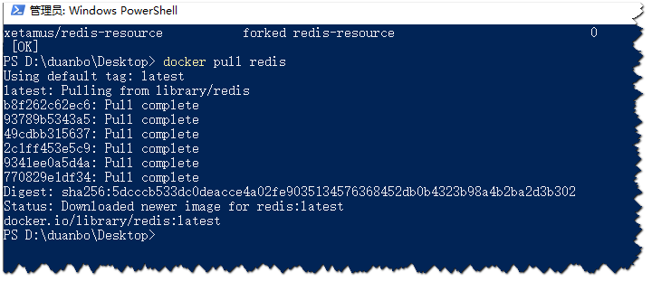

### 查看本地镜像

```bash
docker images
```


### 创建并运行容器

```bash
docker run -d --restart=always --name redis -p 6379:6379 -v /D/DockerData/redis/data:/data redis:latest --appendonly yes --requirepass "123456"
```


### 列出容器

```bash
docker ps -as
```


### 客户端接连 redis（检查可用）

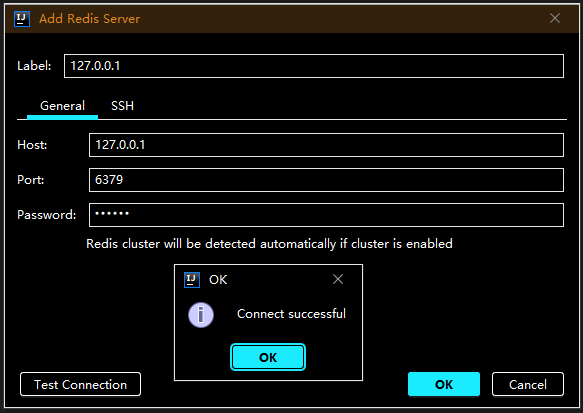

## 用到的 Docker 相关命令

### 命令大集

* https://www.runoob.com/docker/docker-command-manual.html
* https://www.jianshu.com/p/afb20541d781
* https://www.w3xue.com/manual/docker/

### 查找镜像

```bash
docker search redis[:5.5]
```

### 拉取镜像

```bash
docker pull redis[:5.5]
```

### 查看本地镜像

```bash
docker images
```

### 删除本地镜像

```bash
docker rmi <IMAGE ID>
```

### 创建并运行容器

```bash
docker run -help
```

### 停止运行镜像

* NAMES 可能过 docker ps -as 命令获得

```bash
docker stop [ID/NAMES]
```

### 删除运行镜像

* NAMES可能过 docker ps -as 命令获得

```bash
docker rm [ID/NAMES]
```

### 获取容器的日志

* NAMES可能过 docker ps -as 命令获得

```bash
docker logs [ID/NAMES]
```

### 在运行的容器中执行命令

```bash
docker exec -it [ID/NAMES] bash
```

```bash
docker exec -it [ID/NAMES] /bin/sh
```

### 列出容器

```bash
docker ps -as
```

### 复制文件（主机->容器）

* 从主机复制到容器 docker cp [OPTIONS] SRC_PATH|- CONTAINER:DEST_PATH

```bash
docker cp /host/path/target [ID/NAMES]:/file/path/within/container
```

### 复制文件（容器->主机）

* 从容器复制到主机 docker cp [OPTIONS] CONTAINER:SRC_PATH DEST_PATH|-

```bash
docker cp [ID/NAMES]:/file/path/within/container /host/path/target
```

### 查看容器所有状态信息

```bash
docker inspect [NAMES] 
```

### 查看容器IP

```bash
docker inspect --format='{{.NetworkSettings.IPAddress}}' [ID/NAMES]
```

### 容器运行状态

```bash
docker inspect --format '{{.Name}} {{.State.Running}}' [NAMES]
```

### docker network 命令

```bash
docker network --helper
docker network ls
```

## 容器创建运行

### zookeeper

* `zookeeper 3.5.5` 版本

```bash
docker run -d --restart=always --name zookeeper -p 2181:2181 -v /D/DockerData/zookeeper/zk1/data:/data -v /D/DockerData/zookeeper/zk1/datalog:/datalog -e "TZ=Asia/Shanghai" zookeeper:latest
```

### zookeeper 集群（方式1）

* `zookeeper 3.5.5` 版本

- 采用 `host.docker.internal` 访问宿机

  `好像是 18.03 版本开始支持 host.docker.internal`

  ```bash
  host.docker.internal
  ```

- ZOO_SERVERS 中 server.x 参数的地址后面一定要配置 `;2181` 端口，否则成功了也连接不了

  `没有添加 ;2181 怎么搞都连接不了（telnet 直接退出），后来搞个可访方的单个 zookeeper 查看它的 /conf/zoo.cfg 配置文件发现参数 server.1=localhost:2888:3888;2181 后面带了 ;2181 看到这个好像明白了为什么不能访问！`

  `这里使用的是 zookeeper 3.5.5 版本，也许是版本的区别。`

  ```bash
  server.1=0.0.0.0:2888:3888;2181
  ```

- `docker run` 创建并运行 zookeeper 集群（均正常访问 2181、2182、2183 端口）

  ```bash
  ### 运行节点zk1
  docker run -d --restart always --name zk1 -p 2181:2181 -p 2887:2888 -p 3887:3888 -v /D/DockerData/zookeeper/zk1/data:/data -v /D/DockerData/zookeeper/zk1/datalog:/datalog -e "TZ=Asia/Shanghai" -e "ZOO_MY_ID=1" -e "ZOO_SERVERS=server.1=0.0.0.0:2888:3888;2181 server.2=host.docker.internal:2888:3888;2182 server.3=host.docker.internal:2889:3889;2183" zookeeper:latest
  
  ### 运行节点zk2
  docker run -d --restart always --name zk2 -p 2182:2181 -p 2888:2888 -p 3888:3888 -v /D/DockerData/zookeeper/zk2/data:/data -v /D/DockerData/zookeeper/zk2/datalog:/datalog -e "TZ=Asia/Shanghai" -e "ZOO_MY_ID=2" -e "ZOO_SERVERS=server.1=host.docker.internal:2887:3887;2181 server.2=0.0.0.0:2888:3888;2181 server.3=host.docker.internal:2889:3889;21813" zookeeper:latest
  
  ### 运行节点zk3
  docker run -d --restart always --name zk3 -p 2183:2181 -p 2889:2888 -p 3889:3888 -v /D/DockerData/zookeeper/zk3/data:/data -v /D/DockerData/zookeeper/zk3/datalog:/datalog -e "TZ=Asia/Shanghai" -e "ZOO_MY_ID=3" -e "ZOO_SERVERS=server.1=host.docker.internal:2887:3887;2181 server.2=host.docker.internal:2888:3888;2182 server.3=0.0.0.0:2888:3888;2181" zookeeper:latest
  ```

- 可能出现的问题

  配置 `-v /D/DockerData/zookeeper/zk1/conf:/conf` 出现如下错误：

  `好像是 log4j.properties 文件没有造成的问题，查看没有配置 -v /D/DockerData/zookeeper/zk1/conf:/conf 属性正常时查看 /conf 下的文件是有 log4j.properties ，而配置 -v /D/DockerData/zookeeper/zk1/conf:/conf 属性后 /conf 是没有 log4j.properties，判断应该是这个问题导致的错误 `

  只能先去掉 `-v /D/DockerData/zookeeper/zk1/conf:/conf` 

  或改用 `-v /D/DockerData/zookeeper/zk1/conf/zoo.cfg:/conf/zoo.cfg`

  ```bash
  Using config: /conf/zoo.cfg
  log4j:WARN No appenders could be found for logger (org.apache.zookeeper.server.quorum.QuorumPeerConfig).
  log4j:WARN Please initialize the log4j system properly.
  log4j:WARN See http://logging.apache.org/log4j/1.2/faq.html#noconfig for more info.
  ```

  使用容器间访问 `docker network create zk_net 和 `--network zk_net--network-alias zk1` 也不行，容器间 `3888` 访问不通，这个方法实验失败

### zookeeper 集群（方式2）

* `zookeeper 3.5.5` 版本

* 这个方式试验成功，正常启动正常访问

```bash
### 创建 zk_net 网络 (用于ZK容器内部通信使用)
docker network create zk_net

### 运行节点zk1
docker run -d --restart always --network zk_net --network-alias zk1 --name zk1 -p 2181:2181 -v /D/DockerData/zookeeper/zk1/data:/data -v /D/DockerData/zookeeper/zk1/datalog:/datalog -e "TZ=Asia/Shanghai" -e "ZOO_MY_ID=1" -e "ZOO_SERVERS=server.1=0.0.0.0:2888:3888;2181 server.2=zk2:2888:3888;2181 server.3=zk3:2888:3888;2181" zookeeper:latest

### 运行节点zk2
docker run -d --restart always --network zk_net --network-alias zk2 --name zk2 -p 2182:2181 -v /D/DockerData/zookeeper/zk2/data:/data -v /D/DockerData/zookeeper/zk2/datalog:/datalog -e "TZ=Asia/Shanghai" -e "ZOO_MY_ID=2" -e "ZOO_SERVERS=server.1=zk1:2888:3888;2181 server.2=0.0.0.0:2888:3888;2181 server.3=zk3:2888:3888;2181" zookeeper:latest

### 运行节点zk3
docker run -d --restart always --network zk_net --network-alias zk3 --name zk3 -p 2183:2181 -v /D/DockerData/zookeeper/zk3/data:/data -v /D/DockerData/zookeeper/zk3/datalog:/datalog -e "TZ=Asia/Shanghai" -e "ZOO_MY_ID=3" -e "ZOO_SERVERS=server.1=zk1:2888:3888;2181 server.2=zk2:2888:3888;2181 server.3=0.0.0.0:2888:3888;2181" zookeeper:latest
```

### mysql

* `8.0.17` 版本

* https://blog.csdn.net/qq_26462567/article/details/86713638

```bash
docker run -d --restart=always --name mysql -p 3306:3306 -v /D/DockerData/mysql/data:/var/lib/mysql -v /D/DockerData/mysql/log:/var/log/mysql -e "TZ=Asia/Shanghai" -e MYSQL_ROOT_PASSWORD=duanbo mysql:latest --character-set-server=utf8mb4 --collation-server=utf8mb4_unicode_ci
```

* **安装后要做的事（避免后面使用遇到一堆错误）**

```bash
### 连接数据库
docker exec -it mysql mysql -u root -p
### 输入密码
### 切换为 mysql 库
use mysql;
### 设置远程访问
### 1130-host '172.0.0.1' is not allowed to connect to this MySql server
### https://blog.csdn.net/h996666/article/details/80921913
grant all privileges on *.* to 'root'@'%';

### 查询加密方式
select Host,User,plugin from user;
+-----------+------------------+-----------------------+
| Host      | User             | plugin                |
+-----------+------------------+-----------------------+
| %         | root             | caching_sha2_password |
| localhost | mysql.infoschema | caching_sha2_password |
| localhost | mysql.session    | caching_sha2_password |
| localhost | mysql.sys        | caching_sha2_password |
| localhost | root             | caching_sha2_password |
+-----------+------------------+-----------------------+
5 rows in set (0.00 sec)
### 修改为 mysql_native_password 
### 2059 - Authentication plugin 'caching_sha2_password' cannot be loaded:...'
### java.sql.SQLException: Unable to load authentication plugin 'caching_sha2_password'.
alter user 'root'@'%' identified with mysql_native_password by 'duanbo';
### 查询加密方式
select Host,User,plugin from user;
+-----------+------------------+-----------------------+
| Host      | User             | plugin                |
+-----------+------------------+-----------------------+
| %         | root             | mysql_native_password |
| localhost | mysql.infoschema | caching_sha2_password |
| localhost | mysql.session    | caching_sha2_password |
| localhost | mysql.sys        | caching_sha2_password |
| localhost | root             | caching_sha2_password |
+-----------+------------------+-----------------------+
5 rows in set (0.00 sec)

### mysqladmin -u root -p flush-hosts
### 1129-host '172.0.0.1' is blocked because of many connection errors; unblock with ‘mysqladmin flush-hosts’
flush hosts;
### 查询 max_connect_errors 参数值
show variables like '%max_connect_errors%';
+--------------------+-------+
| Variable_name      | Value |
+--------------------+-------+
| max_connect_errors | 100   |
+--------------------+-------+
1 row in set (0.03 sec)
### 设置 max_connect_errors 参数值
set global max_connect_errors = 1000;
### 查询 max_connect_errors 参数值
show variables like '%max_connect_errors%';
+--------------------+-------+
| Variable_name      | Value |
+--------------------+-------+
| max_connect_errors | 1000  |
+--------------------+-------+
1 row in set (0.01 sec)
```

### nacos/nacos-server

* `Naocs 1.1.3` 版本

```bash
docker run -d --restart=always --name nacos --env MODE=standalone -p 8848:8848nacos/nacos-server:latest
```

### nacos/nacos-server 集群

* `Naocs 1.1.3` 版本

* 参考
  
  * https://github.com/nacos-group/nacos-docker
  
  - https://www.cnblogs.com/FlyAway2013/p/11201250.html
  - https://www.cnblogs.com/hellxz/p/nacos-cluster-docker.html
  
* 数据持久化到 `mysql` 数据库中（nacos 的数据库创建相关这里不讲，请自行查阅官网）

* mysql 8.0.x 版本要使用 8.0.x 版本的驱动包

  * 不更为使用 `8.0.x` 驱动包会报错 `SQLException: Unknown system variable 'tx_read_only'`

  * https://github.com/nacos-group/nacos-docker/issues/56

  ```bash
  ### 将驱动包放到 /D/DockerData/nacos/nacosX/plugins/mysql 并挂载
  -v /D/DockerData/nacos/nacosX/plugins/mysql:/home/nacos/plugins/mysql
  ```

```bash
### 创建 nacos 网络
docker network create nacos_net

### nacos1
docker run -d --restart=always --network nacos_net --network-alias nacos1 --name nacos1 --hostname nacos1 -p 8818:8848 -v /D/DockerData/nacos/nacos1/logs:/home/nacos/logs -v /D/DockerData/nacos/nacos1/plugins/mysql:/home/nacos/plugins/mysql --env MODE=cluster --env PREFER_HOST_MODE=hostname --env NACOS_SERVER_PORT=8848 --env SPRING_DATASOURCE_PLATFORM=mysql --env NACOS_SERVERS="nacos1:8848 nacos2:8848 nacos3:8848" --env MYSQL_DATABASE_NUM=2 --env MYSQL_MASTER_SERVICE_HOST=host.docker.internal --env MYSQL_MASTER_SERVICE_PORT=3306 --env MYSQL_SLAVE_SERVICE_HOST=host.docker.internal --env MYSQL_SLAVE_SERVICE_PORT=3306 --env MYSQL_MASTER_SERVICE_DB_NAME=nacos_config --env MYSQL_MASTER_SERVICE_USER=root --env MYSQL_MASTER_SERVICE_PASSWORD=duanbo nacos/nacos-server:latest

### nacos2
docker run -d --restart=always --network nacos_net --network-alias nacos2 --name nacos2 --hostname nacos2 -p 8828:8848 -v /D/DockerData/nacos/nacos2/logs:/home/nacos/logs -v /D/DockerData/nacos/nacos2/plugins/mysql:/home/nacos/plugins/mysql --env MODE=cluster --env PREFER_HOST_MODE=hostname --env NACOS_SERVER_PORT=8848 --env SPRING_DATASOURCE_PLATFORM=mysql --env NACOS_SERVERS="nacos1:8848 nacos2:8848 nacos3:8848" --env MYSQL_DATABASE_NUM=2 --env MYSQL_MASTER_SERVICE_HOST=host.docker.internal --env MYSQL_MASTER_SERVICE_PORT=3306 --env MYSQL_SLAVE_SERVICE_HOST=host.docker.internal --env MYSQL_SLAVE_SERVICE_PORT=3306 --env MYSQL_MASTER_SERVICE_DB_NAME=nacos_config --env MYSQL_MASTER_SERVICE_USER=root --env MYSQL_MASTER_SERVICE_PASSWORD=duanbo nacos/nacos-server:latest

### nacos3
docker run -d --restart=always --network nacos_net --network-alias nacos3 --name nacos3 --hostname nacos3 -p 8838:8848 -v /D/DockerData/nacos/nacos3/logs:/home/nacos/logs -v /D/DockerData/nacos/nacos3/plugins/mysql:/home/nacos/plugins/mysql --env MODE=cluster --env PREFER_HOST_MODE=hostname --env NACOS_SERVER_PORT=8848 --env SPRING_DATASOURCE_PLATFORM=mysql --env NACOS_SERVERS="nacos1:8848 nacos2:8848 nacos3:8848" --env MYSQL_DATABASE_NUM=2 --env MYSQL_MASTER_SERVICE_HOST=host.docker.internal --env MYSQL_MASTER_SERVICE_PORT=3306 --env MYSQL_SLAVE_SERVICE_HOST=host.docker.internal --env MYSQL_SLAVE_SERVICE_PORT=3306 --env MYSQL_MASTER_SERVICE_DB_NAME=nacos_config --env MYSQL_MASTER_SERVICE_USER=root --env MYSQL_MASTER_SERVICE_PASSWORD=duanbo nacos/nacos-server:latest
```

### nginx

* `Nginx 1.17.4` 版本

* 这里代理上面创建的 `nacos cluster`

```bash
### nacos-ngx
docker run -d --restart=always --network nacos_net --network-alias nacos-ngx --name nacos-ngx --hostname nacos-ngx -p 8848:80 -v /D/DockerData/nacos-ngx/html:/usr/share/nginx/html -v /D/DockerData/nacos-ngx/conf/nginx.conf:/etc/nginx/nginx.conf -v /D/DockerData/nacos-ngx/conf.d:/etc/nginx/conf.d -v /D/DockerData/nacos-ngx/logs:/var/log/nginx -e "TZ=Asia/Shanghai" nginx:latest
```

* `/etc/nginx/nginx.conf` 添加 `upstream nacos_cluster {...}` 配置

  `http` 节点下添加 `upstream` 命名为 `nacos_cluster`，要添加在 `include /etc/nginx/conf.d/*.conf;` 之前！

  详见以下配置信息：

  ```bash
  user  nginx;
  worker_processes  1;
  
  error_log  /var/log/nginx/error.log warn;
  pid        /var/run/nginx.pid;
  
  
  events {
      worker_connections  1024;
  }
  
  
  http {
      include       /etc/nginx/mime.types;
      default_type  application/octet-stream;
  
      log_format  main  '$remote_addr - $remote_user [$time_local] "$request" '
                        '$status $body_bytes_sent "$http_referer" '
                        '"$http_user_agent" "$http_x_forwarded_for"';
  
      access_log  /var/log/nginx/access.log  main;
  
      sendfile        on;
      #tcp_nopush     on;
  
      keepalive_timeout  65;
  
      #gzip  on;
  	
  	# nacos cluster 节点
      upstream nacos_cluster {
          server nacos1:8848;
          server nacos2:8848;
          server nacos3:8848;
      }
  
      include /etc/nginx/conf.d/*.conf;
  	
  }
  ```

* `/etc/nginx/conf.d` 添加 `location /nacos {...}` 节点和修改 `locastion / {...}` 节点

  详见以下配置信息：

  ```bash
  server {
      listen       80;
      server_name  localhost;
  
      #charset koi8-r;
      #access_log  /var/log/nginx/host.access.log  main;
  	
  	#location /nacos {
      #   proxy_pass http://nacos_cluster/nacos;
          # 请使用 $http_host 别使用 $host
          # 否则访问 http://127.0.0.1:8848/nacos 会重定向到 http://127.0.0.1/nacos/ 打不开
  	#	proxy_set_header Host $http_host;
      #}
  
      location / {
  		proxy_pass http://nacos_cluster;
  		# 请使用 $http_host 别使用 $host
          # 否则访问 http://127.0.0.1:8848/nacos 会重定向到 http://127.0.0.1/nacos/ 打不开
  		proxy_set_header Host $http_host;
          #root   /usr/share/nginx/html;
          #index  index.html index.htm;
      }
  
      #error_page  404              /404.html;
  
      # redirect server error pages to the static page /50x.html
      #
      error_page   500 502 503 504  /50x.html;
      location = /50x.html {
          root   /usr/share/nginx/html;
      }
  }
  ```

### jenkins

```bash
docker run -d --restart=always --name jenkins -p 8088:8080 --restart always -v /D/DockerData/jenkins/jenkins_home:/var/jenkins_home -t jenkins:latest
```

### centos

```bash
docker run --privileged --cap-add SYS_ADMIN -e container=docker -it --name centos -d --restart=always centos:latest /usr/sbin/init
```

### sonatype/nexus3

```bash
docker run -d -p 8081:8081 --restart=always --name nexus -v /D/DockerData/nexus-data:/nexus-data sonatype/nexus3:latest
```

### gitlab/gitlab-ce

* https://juejin.im/post/5cc1df885188252d6c43fd91

```bash
docker run --detach --hostname gitlab.boazy.com --publish 444:443 --publish 88:80 --publish 23:22 --name gitlab --restart always --volume /D/DockerData/gitlab/config:/etc/gitlab --volume /D/DockerData/gitlab/logs:/var/log/gitlab --volume /D/DockerData/gitlab/data:/var/opt/gitlab gitlab/gitlab-ce:latest
```

### km-pigeon/gds-instant-app

```bash
docker run -p 9903:9903 -d --restart=always --name gds-instant-app km-pigeon/gds-instant-app:latest
```

## Spring boot 打包为 Docker Image

### pom.xml 引入插件

```xml
<!-- Docker maven plugin -->
<plugin>
	<groupId>com.spotify</groupId>
	<artifactId>docker-maven-plugin</artifactId>
	<version>1.2.1</version>
	<configuration>
		<imageName>km-pigeon/${project.artifactId}</imageName>
		<!--<imageTags>
			<imageTag>${project.version}</imageTag>
		</imageTags>
		<forceTags>true</forceTags>-->
		<dockerDirectory>src/main/docker</dockerDirectory>
		<resources>
			<resource>
				<targetPath>/</targetPath>
				<directory>${project.build.directory}</directory>
				<include>${project.build.finalName}.jar</include>
			</resource>
		</resources>
	</configuration>
</plugin>
```

* docker-maven-plugin 下载不了时配置 `settings.xml` 文件 `pluginGroups` 节点中添加以下配置信息：

  ```xml
  <pluginGroup>com.spotify</pluginGroup>
  ```

### 项目创建 src/main/docker 目录

* `src/main/docker`

### src/main/docker 下创建 Dockerfile 文件

* `src/main/docker/Dockerfile`

  ```bash
  FROM openjdk:8-jdk-alpine
  VOLUME /tmp
  ADD gds-instant-app-*.jar /home/webapps/gds-instant-app/gds-instant-app.jar
  EXPOSE 9903
  ENTRYPOINT ["java","-Djava.security.egd=file:/dev/./urandom", "-Duser.timezone=Asia/Shanghai","-jar","/home/webapps/gds-instant-app/gds-instant-app.jar"]
  ```

### 执行镜像构建命令

* `mvn clean package docker:build`

  ```bash
  mvn clean package docker:build
  ```

## 缘分问题

### Docker 重起后容器不自动启动

* 右击任务栏 Docker 图标 `Restart` 或 `Quit Docker Deskto` 后之前正常的 zookeeper 容器不会自动启动

  通过命令 `docker start zk1` 启动报错如下错误：

  ```bash
  Error response from daemon: driver failed programming external connectivity on endpoint zk1 (7cfb61e95c9ae834e3339d98574ac96f12ab94659bcf573a2a50204ff38164e6): Error starting userland proxy: /forwards/expose/port returned unexpected status: 500
  Error: failed to start containers: zk1
  ```

* 解决方法

  参考：https://qiita.com/masaoops/items/e79157ec89cd991ef8d2

  * Quit Docker Desktop（右击任务栏图标）
  * 进入 `Windows 任务管理器`，干掉进程 `com.docker.backend.exe` 进程
  * 过一会 `com.docker.backend.exe` 进程会自己重新启动好
  * 再打开 Docker Desktop （双击桌面图标）
  * 当 Docker Desktop 启动好后，zookeeper 容器也自动成功正常启动完了