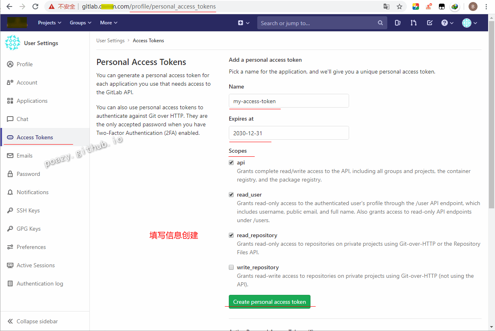
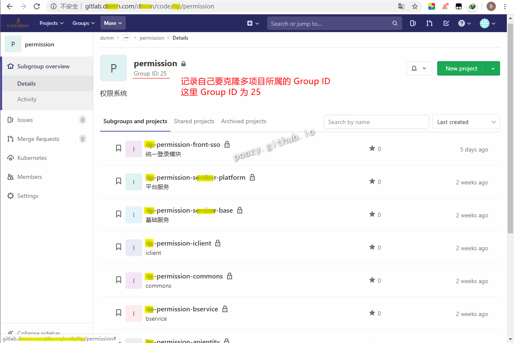
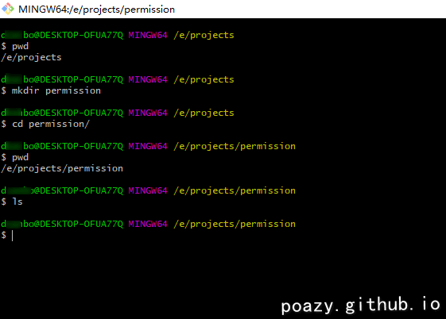
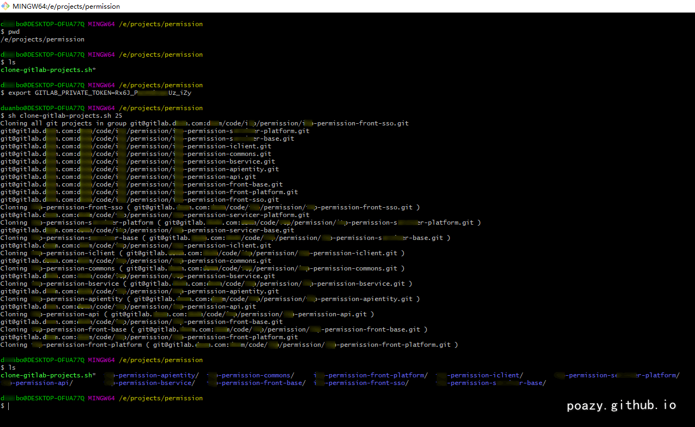

* content
{:toc}
> 有时候我们需要一次克隆 GitLab Group（组）下的所有 Project（项目），而不是手工操作一个个克隆这样麻烦的操作！
> 
> 通过编写脚本 + GitLab API + GitLab Personal Access Tokens + GitLab Group ID 实现一次克隆组下所有项目
>
> 这只是种方式...更丰富可以修改脚本实现


# Group 多 Project 克隆

* 一次克隆 Group 下所有 Project 命令

```bash
# 导入 Access Tokens
# 在 http://ip:port/profile/personal_access_tokens 获得 Access Tokens
export GITLAB_PRIVATE_TOKEN=xxxXjxx5xX1xAEX_96_x
# 执行脚本文件克隆 Group ID 为 25 的 Group 下所有的 Project
sh clone-gitlab-projects.sh 25
```

* 一次克隆 Group 下所有 Project 脚本文件，文件名为：`clone-gitlab-projects.sh`

> `clone-gitlab-projects.sh` 脚本文件内容如下：

```bash
#!/usr/bin/env bash

BASE_PATH="http://gitlab.dsmm.com/"

if [ -z "$1" ]
  then echo "group name is required."
    exit 1;
fi 

GROUP="$1"

GROUP_INFO=$(curl -s "${BASE_PATH}api/v4/groups?private_token=$GITLAB_PRIVATE_TOKEN&per_page=999" \
    | grep -o "\"id\":[^ ,]\+" | awk -F'"' '{print $4}')

# export GITLAB_PRIVATE_TOKEN=ixfxFxYXbxN_XaxtxEXW
if [ -z "$GITLAB_PRIVATE_TOKEN" ]; then echo "Please set the environment variable GITLAB_PRIVATE_TOKEN"
    echo "See ${BASE_PATH}profile/personal_access_tokens"
    exit 1
fi 

FIELD_NAME="ssh_url_to_repo"

REPO_SSH_URLS=$(curl -s "${BASE_PATH}api/v4/groups/$GROUP/projects?private_token=$GITLAB_PRIVATE_TOKEN&per_page=999" \
    | grep -o "\"$FIELD_NAME\":[^ ,]\+" | awk -F'"' '{print $4}')

echo "Cloning all git projects in group $REPO_SSH_URLS";

for REPO_SSH_URL in $REPO_SSH_URLS; do THEPATH=$(echo "$REPO_SSH_URL" | awk -F'/' '{print $NF}' | awk -F'.' '{print $1}')

    echo "$REPO_SSH_URL"

    if [ ! -d "$THEPATH" ]; then echo "Cloning $THEPATH ( $REPO_SSH_URL )"
        git clone "$REPO_SSH_URL" --quiet &
    else echo "Pulling $THEPATH"
        (cd "$THEPATH" && git pull --quiet) &
    fi done
```


# 本案例实际操作

* 需要信息
  * 自己 GitLab 账号的 Personal Access Token
  * 要克隆的 Group ID
  * 克隆脚本文件 clone-gitlab-projects.sh

## 获取自己 GitLab 账号的 Access Tokens

* 从  http://gitlab.xxx.com/profile/personal_access_tokens 获取自己的 Access Token

```bash
Rx6J_PaxKGkopwUz_iZy
```




## 获取要克隆 Group 下多 Project 的 Group ID

* 从  http://gitlab.xxx.com/xxx/code/xxx/permission 获取 Group ID

```bash
25
```



## 创建目录 & 创建脚本

* 创建 permission 目录，克隆下来的目录都放在这个目录下

```bash
# 创建 permission 目录并切换到 permission 目录下
mkdir permission
cd permission
```

> 以下是创建命令结果展示：

```bash
duanbo@DESKTOP-OFUA77Q MINGW64 /e/projects
$ pwd
/e/projects

duanbo@DESKTOP-OFUA77Q MINGW64 /e/projects
$ mkdir permission

duanbo@DESKTOP-OFUA77Q MINGW64 /e/projects
$ cd permission/

duanbo@DESKTOP-OFUA77Q MINGW64 /e/projects/permission
$ pwd
/e/projects/permission

duanbo@DESKTOP-OFUA77Q MINGW64 /e/projects/permission
$ ls

duanbo@DESKTOP-OFUA77Q MINGW64 /e/projects/permission
$
```



* 在 permission 目录下创建脚本文件 `clone-gitlab-projects.sh`

```bash
vi clone-gitlab-projects.sh
# vi 输入 i 编辑
# 从第一章中复制 clone-gitlab-projects.sh 的文件内容插入
# 记得把内容中的 http://gitlab.xxx.com/ 改成自己的 GitLab 地址！
# 按下 Esc 键，输入 wq 回车 以保存退出
```

> 以下是创建命令结果展示：

```bash
duanbo@DESKTOP-OFUA77Q MINGW64 /e/projects/permission
$ pwd
/e/projects/permission

duanbo@DESKTOP-OFUA77Q MINGW64 /e/projects/permission
$ ls

duanbo@DESKTOP-OFUA77Q MINGW64 /e/projects/permission
$ vi clone-gitlab-projects.sh

duanbo@DESKTOP-OFUA77Q MINGW64 /e/projects/permission
$ cat clone-gitlab-projects.sh
#!/usr/bin/env bash

BASE_PATH="http://gitlab.xxx.com/"

if [ -z "$1" ]
  then echo "group name is required."
    exit 1;
fi

GROUP="$1"

GROUP_INFO=$(curl -s "${BASE_PATH}api/v4/groups?private_token=$GITLAB_PRIVATE_TOKEN&per_page=999" \
    | grep -o "\"id\":[^ ,]\+" | awk -F'"' '{print $4}')

# export GITLAB_PRIVATE_TOKEN=ixfxFxYXbxN_XaxtxEXW
if [ -z "$GITLAB_PRIVATE_TOKEN" ]; then echo "Please set the environment variable GITLAB_PRIVATE_TOKEN"
    echo "See ${BASE_PATH}profile/personal_access_tokens"
    exit 1
fi

FIELD_NAME="ssh_url_to_repo"

REPO_SSH_URLS=$(curl -s "${BASE_PATH}api/v4/groups/$GROUP/projects?private_token=$GITLAB_PRIVATE_TOKEN&per_page=999" \
    | grep -o "\"$FIELD_NAME\":[^ ,]\+" | awk -F'"' '{print $4}')

echo "Cloning all git projects in group $REPO_SSH_URLS";

for REPO_SSH_URL in $REPO_SSH_URLS; do THEPATH=$(echo "$REPO_SSH_URL" | awk -F'/' '{print $NF}' | awk -F'.' '{print $1}')

    echo "$REPO_SSH_URL"

    if [ ! -d "$THEPATH" ]; then echo "Cloning $THEPATH ( $REPO_SSH_URL )"
        git clone "$REPO_SSH_URL" --quiet &
    else echo "Pulling $THEPATH"
        (cd "$THEPATH" && git pull --quiet) &
    fi done

duanbo@DESKTOP-OFUA77Q MINGW64 /e/projects/permission
$
```


## 执行命令克隆 Gruop 下所有的 Project

* 导入自己 GitLab 账号的 Personal Access Token（之前已获取好的）

```bash
export GITLAB_PRIVATE_TOKEN=Rx6J_PaxKGkopwUz_iZy
```

* 执行 `sh clone-gitlab-projects.sh 25` 克隆（25 是要克隆项目的 Group ID，之前上面已有获取好的）

```bash
sh clone-gitlab-projects.sh 25
```

> 从结果图上可以看出 Group 下的所有项目均克隆下来了，执行结果截图如下：

